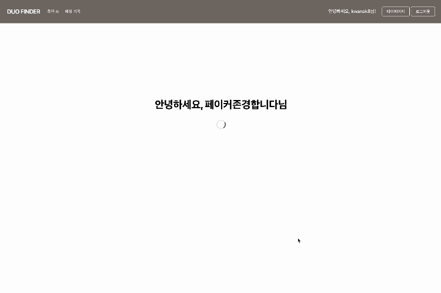
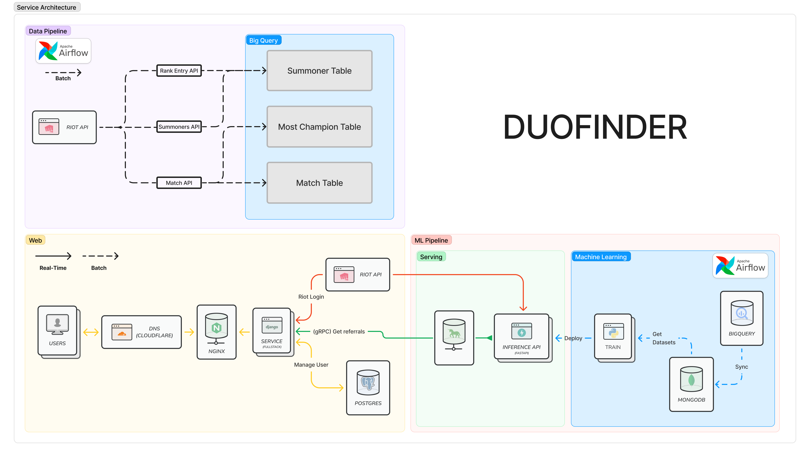
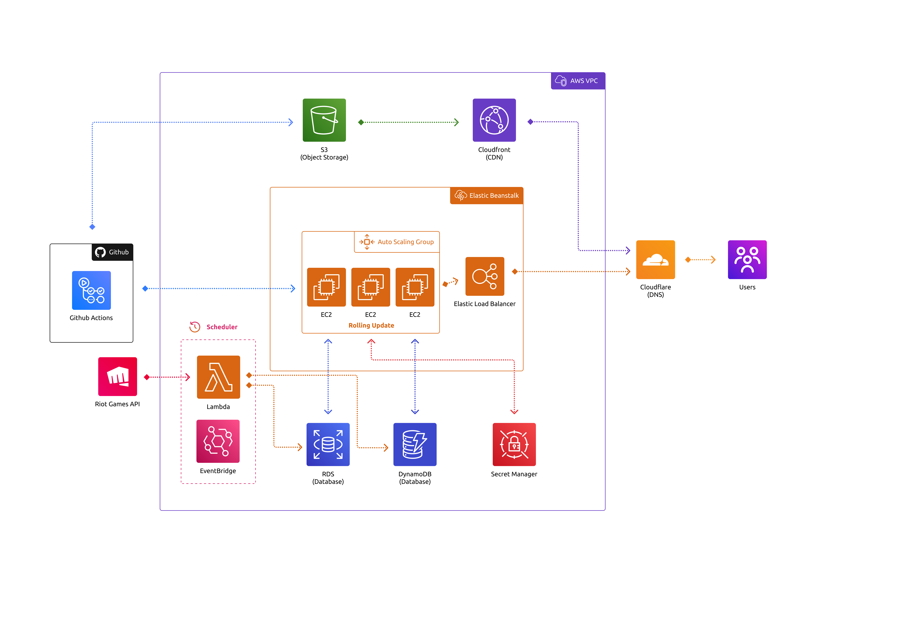
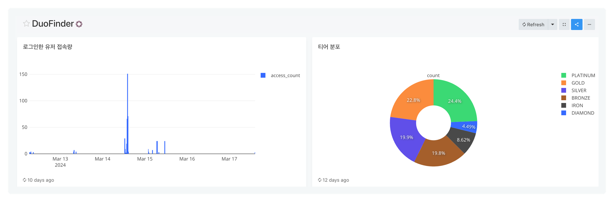
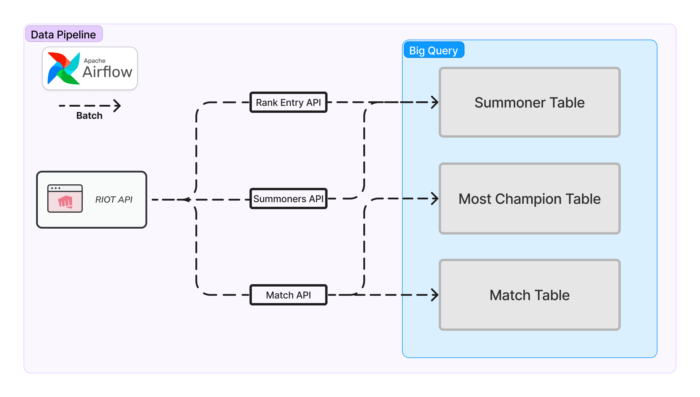
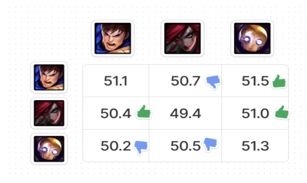
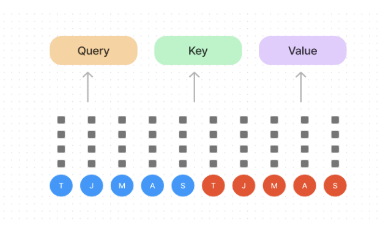

# Duo Finder

## 📌 프로젝트 소개

DuoFinder는 리그 오브 레전드 플레이어에게 최적의 듀오를 추천하기 위해 만든 **듀오 추천 인공지능 서비스**입니다.

이 서비스의 목표는 **서비스 이용자와 가장 적합한 듀오를 찾도록 도와 게임 만족도를 향상시키는 것**입니다.

머신 러닝을 활용하여 유저의 성향, 선호하는 챔피언, 게임 플레이 스타일을 분석하여 최적의 듀오 파트너를 추천합니다.

## 🛠️ 아키텍쳐 구성도

### 서비스 아키텍쳐

### 인프라 아키텍쳐

## 🗄️ 데이터

### 데이터 분석 플랫폼 - Redash([Link](https://analysis.duofinder.kr/public/dashboards/9WWi0bfCKTeORxVVwN7rQhGeCAuTWoK9B7vUZ4nI?org_slug=default))

### Data Pipeline Flow

`Airflow`를 사용해 리그 오브 레전드의 패치 주기인 **2주 간격의 목요일마다 새로운 학습 데이터를 비동기 방식으로 수집**해 `Big Query`에 적재

### 데이터 수집

**[RIOT API](https://developer.riotgames.com/apis)를 사용하여 데이터 수집 진행**

- **[summoner information](https://developer.riotgames.com/apis#league-v4/GET_getLeagueEntries)**
    - 유저의 정보 수집
- **[puuid](https://developer.riotgames.com/apis#summoner-v4/GET_getBySummonerId)**
    - `summoner information`에서 수집한 `summonerId`를 통해 유저의 `puuid`(고유 식별 ID) 수집
    - `match information` 수집
- **[match information](https://developer.riotgames.com/apis#match-v5/GET_getMatch)**
    - `puuid`를 통해 각 `puuid` 별 최대 100개의 [match ID](https://developer.riotgames.com/apis#match-v5/GET_getMatchIdsByPUUID) 수집
    - 수집한 `match ID`를 통해 **유저의 경기 기록**과 **경기의 세부 데이터** 수집

### 데이터 전처리
`json 파일`로 추출한 데이터에서 필요한 칼럼만 추출하여 `Data Warehouse(Big Query)`에 적재

### 수집 결과

    
<b>ERD Image</b>

    

        
    

- **summoner**
    - `유저의 이름`과 `고유 식별 ID(puuid)`를 저장한 테이블
    - 210만 건 수집
- **match**
    - `경기 기록`을 저장한 테이블
    - 1,200만 건 수집
- **most_champion**
    - 각 유저 별로 가장 많이 플레이 한 `상위 3개의 챔피언 정보`
    - 195만 건 수집

## 💻 추천 모델
### Memory-based Collaborative Filtering

- 통계 기반이라 **가볍고**, **빠르게**결과를 생성가능
- 결과에 대한 **설명력**이 좋음
- **cold-start 유저**에 추천 가능

### self attention similarity

- 각 유저의 플레이 성향으로 **클러스터링**
- 피드백이 수집되면 피드백을 활용해 선호하는 유저와 유사한 유저를 우선 추천

## 🤖 팀원
<table align="center">
  <tr height="155px">
    <td align="center" width="150px">
      
    </td>
    <td align="center" width="150px">
      
    </td>
    <td align="center" width="150px">
      
    </td>
    <td align="center" width="150px">
      
    </td>
  </tr>
  <tr height="80px">
    <td align="center" width="150px">
      <a href="https://github.com/kwanok">노관옥</a>
    </td>
    <td align="center" width="150px">
      <a href="https://github.com/power16one5">박경원</a>
    </td>
    <td align="center" width="150px">
      <a href="https://github.com/seokulee">이석규</a>
    </td>
    <td align="center" width="150px">
      <a href="https://github.com/ksj1368">장성준</a>
    </td>
  </tr>
  <tr height="80px">
    <td align="center" width="150px">
    AWS 인프라 구축, CI/CD 
    Django 기반 Fullstack Web 배포 및 호스팅 
    Redash 배포 및 호스팅 
    </td>
    <td align="center" width="150px">
    모델링 
    데이터 전처리 
    병렬 학습 환경 구축 
    </td>
    <td align="center" width="150px">
    데이터 수집 및 전처리 
    데이터 분석 
    추천 시스템 모델링 
    Inference 서빙 
    </td>
    <td align="center" width="150px">
    데이터 수집 및 전처리 
    데이터 파이프라인 설계 및 구축 
    ERD 설계 
    Big Query 구축 
    </td>
  </tr>
</table>
&nbsp;

## 🖥️ Presentation

[Presentation PDF](./assets/duo_finder_pdf.pdf)

발표자료와 발표영상입니다.
