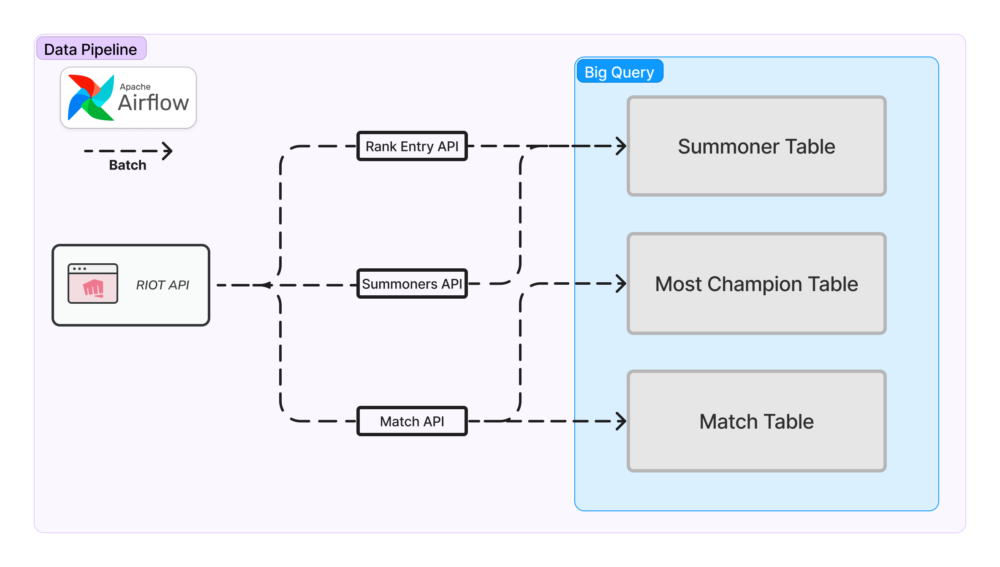

## League of Legends summoner, match data ETL pipeline 
### Pipeline Flow


### Venv setting
- python==3.8.10
``` bash
python -m venv .venv

source .venv/bin/activate

pip install pip --upgrade
pip install -r requirements.txt
```
### Airflow setting
``` bash
export AIRFLOW_HOME=`pwd`
echo $AIRFLOW_HOME

airfloe db init

airflow users create \
--username your_name \
--password your_password \
--firstname your_firstname \
--lastname your_lastname \
--role Admin \
--email your_email
```

### Airflow Web server run
``` bash
export AIRFLOW_HOME=`pwd`
echo $AIRFLOW_HOME

airflow webserver --port 8080
```
- If airflow connection error occurs

``` bash
kill $(lsof -t -i:8080)
```

### Airflow Scheduler run
``` bash
source .venv/bin/activate
export AIRFLOW_HOME=`pwd`
airflow scheduler
```
- If airflow connection error occurs
``` bash
kill $(lsof -t -i:8793)
```
